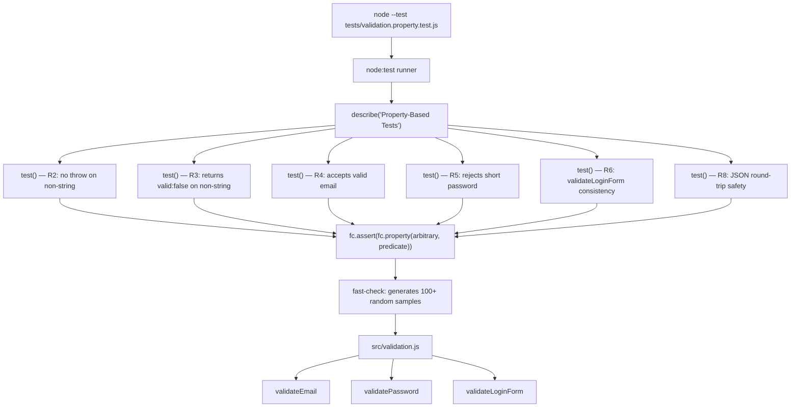

# Design Document — Property-Based Validation Test Suite

## Overview

This design describes how property-based tests are added to the `examples/demo-bug-repo` project to formally verify the authentication validation utilities in `src/validation.js`. The goal is to move beyond spot-checked examples and instead prove invariants across the entire input space for `validateEmail`, `validatePassword`, and `validateLoginForm`.

The feature produces a single new file — `tests/validation.property.test.js` — that runs alongside the existing `tests/validation.test.js` with no changes to either the production code or the existing tests. The new file uses [`fast-check`](https://fast-check.dev/) as the property-based testing engine and the built-in `node:test` / `node:assert/strict` as the test harness, matching the project's existing style exactly.

One of the properties (`validateEmail does not throw for any non-string input`) is intentionally **red** until the known null/undefined crash bug in `src/validation.js` line 18 is fixed. This is a deliberate design choice: the property acts as a formal regression gate that prevents merging until the bug is resolved.

### Key Design Decisions

| Decision | Choice | Rationale |
|---|---|---|
| PBT library | `fast-check` (pinned `^3.0.0`) | Mature, ESM-native, rich Arbitrary ecosystem, widely used in JS |
| Test harness | `node:test` + `node:assert/strict` | Matches existing project tooling; no extra dependencies |
| ESM import | `import * as fc from 'fast-check'` | Required by `"type": "module"` in `package.json` |
| Integration pattern | `fc.assert(fc.property(...))` wrapped inside `test()` | Lets `node:test` own the runner lifecycle while `fast-check` handles generation |
| Iteration count | 100 (fast-check default) | Sufficient for exposing common edge cases; configurable per property |
| Bug capture strategy | Red test in R2 + R3 | Forces the crash to be visible in CI before the null guard is added |

---

## Architecture

The feature is purely additive. No existing source file is modified.



### Test Discovery

The root `package.json` `test:demo` script runs:

```bash
npm --prefix examples/demo-bug-repo test
```

The `demo-bug-repo/package.json` `test` script is:

```bash
node --test tests/validation.test.js
```

To make `node --test` discover **both** files, this script will be updated to:

```bash
node --test tests/validation.test.js tests/validation.property.test.js
```

The `node --test` runner accepts multiple file globs/paths, so this is the minimal change needed — no extra tooling, no changes to the root script.

---

## Components and Interfaces

### 1. `tests/validation.property.test.js` — the Test Suite

The single new file. Structured as one top-level `describe` block with one `test()` call per requirement, each wrapping a `fc.assert(fc.property(...))` call.

```
describe('Property-Based Validation Tests')
  ├── test('R2 — validateEmail does not throw for any non-string input')
  ├── test('R3 — validateEmail returns { valid: false } for non-string input')
  ├── test('R4 — validateEmail accepts any valid email string')
  ├── test('R5 — validatePassword rejects any string shorter than 8 characters')
  ├── test('R6 — validateLoginForm is consistent with component validators')
  └── test('R8 — ValidationResult is JSON round-trip safe')
```

### 2. Arbitrary Generators

Each property uses a specific `fast-check` Arbitrary:

| Property | Arbitrary | Produces |
|---|---|---|
| R2, R3 | `fc.oneof(fc.constant(undefined), fc.constant(null), fc.integer(), fc.boolean(), fc.object(), fc.array(fc.anything()))` | Non-String values |
| R4 | `fc.emailAddress()` | Well-formed email strings satisfying `^[^\s@]+@[^\s@]+\.[^\s@]+$` |
| R5 | `fc.string({ maxLength: 7 })` | Strings of length 0–7 |
| R6 | `fc.record({ email: fc.string(), password: fc.string() })` | Arbitrary `{ email, password }` objects |
| R8 | `fc.oneof(fc.string(), fc.constant(null), fc.constant(undefined), fc.integer(), fc.emailAddress(), fc.string({ maxLength: 7 }))` combined with a record for form data | Covers inputs to all three validators |

### 3. `fc.assert` / `fc.property` Integration Pattern

```js
// Pattern used for every property in the suite:
test('property description', () => {
  fc.assert(
    fc.property(someArbitrary, (generatedValue) => {
      // assertion using node:assert/strict
    }),
    { numRuns: 100 }  // explicit, but matches fast-check default
  );
});
```

`fc.assert` throws on the first falsifying example, which causes `node:test` to mark the test as failed and prints the minimal shrunk counterexample.

### 4. `src/validation.js` (read-only reference)

| Export | Signature | Known behaviour |
|---|---|---|
| `validateEmail(email)` | `(any) → ValidationResult` | Crashes on non-string; returns `{ valid: true }` for well-formed emails |
| `validatePassword(password)` | `(any) → ValidationResult` | Guards against non-string; rejects strings shorter than 8 chars |
| `validateLoginForm(formData)` | `(object\|any) → ValidationResult` | Delegates to `validateEmail` then `validatePassword`; inherits email crash |

---

## Data Models

### `ValidationResult`

All three validators return an object conforming to this shape:

```ts
type ValidationResult =
  | { valid: true }
  | { valid: false; error: string }
```

Key constraints used in properties:
- `valid` is always a boolean.
- When `valid === false`, `error` is always a non-empty string.
- The object contains no methods, Symbols, or non-serialisable values — making it safe for JSON round-trip (R8).

### Non-String Inputs (R2, R3)

Generated by the Arbitrary:

```js
fc.oneof(
  fc.constant(undefined),
  fc.constant(null),
  fc.integer(),
  fc.boolean(),
  fc.object(),
  fc.array(fc.anything())
)
```

This covers all `typeof value !== 'string'` cases. `fc.oneof` gives equal weight to each sub-Arbitrary, ensuring `undefined` and `null` are sampled regularly rather than being lost in a large space.

### Valid Email Strings (R4)

`fc.emailAddress()` generates RFC-5321-style addresses that satisfy the regex `^[^\s@]+@[^\s@]+\.[^\s@]+$`. This is the canonical fast-check Arbitrary for email generation — it handles local part, `@`, and domain-with-TLD automatically.

### Short Passwords (R5)

`fc.string({ maxLength: 7 })` generates strings of length 0 through 7 inclusive. The empty string is included (length 0 < 8), covering both the "missing" and "too short" sub-cases.

### Form Data Records (R6)

```js
fc.record({
  email: fc.string(),
  password: fc.string()
})
```

Generates arbitrary `{ email, password }` objects with any string values. This covers valid emails, invalid emails, short passwords, long passwords, and edge cases all in one Arbitrary. The property logic then branches on the results of the individual validators to check consistency.

---

## Correctness Properties

*A property is a characteristic or behavior that should hold true across all valid executions of a system — essentially, a formal statement about what the system should do. Properties serve as the bridge between human-readable specifications and machine-verifiable correctness guarantees.*

This feature is well-suited to property-based testing. The three validators are pure functions (no I/O, no side effects) whose correctness is defined by invariants that must hold across the entire input space — not just the handful of examples a human would pick by hand. The known null/undefined crash bug is a perfect example of a failure that a single `validateEmail(undefined)` call would expose, but that might be missed if only `validateEmail('')` was tested.

Six properties are defined. Properties 1 and 2 are intentionally **red** until the null guard bug in `validateEmail` is fixed.

---

### Property 1: validateEmail does not throw for any non-string input

*For any* JavaScript value that is not a string (`undefined`, `null`, a number, a boolean, an object, or an array), calling `validateEmail(value)` SHALL complete without throwing an exception.

**Validates: Requirements 2.2, 2.3, 2.4, 2.5**

> **Red until fixed**: This property will fail with the current `src/validation.js` because `email.trim()` at line 18 throws `TypeError: Cannot read properties of undefined (reading 'trim')` when `email` is `undefined` or `null`. The failing shrunk counterexample from fast-check will be exactly `undefined`, making the bug trivially reproducible.

---

### Property 2: validateEmail returns `{ valid: false }` for any non-string input

*For any* JavaScript value that is not a string, calling `validateEmail(value)` SHALL return a `ValidationResult` with `valid === false`.

**Validates: Requirements 3.1, 3.2, 3.3**

> **Red until fixed**: Depends on Property 1 — once the function no longer throws, this property verifies the return value is also correct (not merely non-crashing). Both properties together constitute the full fix contract.

---

### Property 3: validateEmail accepts any well-formed email string

*For any* string that satisfies the pattern `^[^\s@]+@[^\s@]+\.[^\s@]+$` (as produced by `fc.emailAddress()`), calling `validateEmail(value)` SHALL return a `ValidationResult` with `valid === true`.

**Validates: Requirements 4.1, 4.2, 4.3, 4.4**

> This property guards against false-negative rejections — scenarios where a technically valid email is incorrectly rejected by an overly strict regex or normalization bug.

---

### Property 4: validatePassword rejects any string shorter than 8 characters

*For any* string whose `.length` is strictly less than 8, calling `validatePassword(value)` SHALL return a `ValidationResult` with `valid === false` and `error === 'Password must be at least 8 characters'`.

**Validates: Requirements 5.1, 5.2, 5.3, 5.4, 5.5**

> The empty string (length 0), whitespace-only strings, and unicode strings are all included in the generated input space via `fc.string({ maxLength: 7 })`. The property verifies both the boolean flag and the exact error message.

---

### Property 5: validateLoginForm is consistent with its component validators (metamorphic property)

*For any* object `{ email: string, password: string }`, the result of `validateLoginForm({ email, password })` SHALL be consistent with the independent results of `validateEmail(email)` and `validatePassword(password)`:

- If `validateEmail(email).valid === false`, then `validateLoginForm(...).valid === false`.
- If `validateEmail(email).valid === true` and `validatePassword(password).valid === false`, then `validateLoginForm(...).valid === false`.
- If `validateEmail(email).valid === true` and `validatePassword(password).valid === true`, then `validateLoginForm(...).valid === true`.

**Validates: Requirements 6.1, 6.2, 6.3, 6.4, 6.5, 6.6, 6.7**

> This is a metamorphic property: rather than knowing the exact output, we know a relationship that must hold between the composite function and its components. It detects silent inconsistencies where `validateLoginForm` might accept inputs that `validateEmail` or `validatePassword` individually reject, or vice versa.

---

### Property 6: ValidationResult is JSON round-trip safe

*For any* input to any of the three validators (`validateEmail`, `validatePassword`, `validateLoginForm`), the returned `ValidationResult` SHALL satisfy `deepEqual(JSON.parse(JSON.stringify(result)), result)`.

**Validates: Requirements 8.1, 8.2, 8.3, 8.4**

> This is a round-trip property. It verifies that validation results contain no non-serialisable values (functions, Symbols, `undefined` fields, circular references, class instances). Since `ValidationResult` is defined as `{ valid: boolean, error?: string }`, this should always hold — but this property ensures no future refactor inadvertently breaks that contract.

---

## Error Handling

### Bug Capture and Reporting

The primary error handling concern is that Property 1 is **designed to fail** until `src/validation.js` is patched. When `validateEmail(undefined)` throws, `fc.assert` catches the exception, shrinks the input to the minimal failing case (which fast-check will find immediately as `undefined`), and re-throws with a report like:

```
Property failed after 1 tests
{ seed: ..., path: "0", endOnFailure: true }
Counterexample: [undefined]
Shrunk 0 time(s)
Got error: TypeError: Cannot read properties of undefined (reading 'trim')
```

`node:test` receives this as a thrown error and marks the test as failed with a non-zero exit code, blocking CI.

### assert.doesNotThrow Wrapping (R2)

Property 1 uses `assert.doesNotThrow` inside the property body rather than relying on `fc.assert` to catch the throw directly. This is intentional: it produces a clearer failure message that names the crash as an assertion failure, not an unexpected exception in the property runner.

```js
fc.assert(
  fc.property(nonStringArbitrary, (input) => {
    assert.doesNotThrow(() => validateEmail(input));
  })
);
```

### JSON Round-Trip Errors (R8)

If a future `ValidationResult` gains a non-serialisable field, `JSON.stringify` will either silently drop it or throw. Property 6 catches both cases: silent drops fail the deep-equal, and throws propagate as property failures.

---

## Testing Strategy

### Dual Approach

| Layer | Tool | Purpose |
|---|---|---|
| Example-based unit tests | `node:test` + `node:assert/strict` | Specific scenarios, regression for exact error messages |
| Property-based tests | `fast-check` + `node:test` | Universal invariants across the full input space |

The existing `tests/validation.test.js` covers concrete examples including the documented crash. The new `tests/validation.property.test.js` covers the six properties above.

### Property-Based Testing with fast-check

**Library**: [`fast-check`](https://fast-check.dev/) v3.x (pinned `^3.0.0`)

**Integration pattern** — each property follows this structure:

```js
test('description', () => {
  fc.assert(
    fc.property(arbitrary, (value) => {
      // assertion using node:assert/strict
    }),
    { numRuns: 100 }
  );
});
```

**Tag format** for each property test comment:

```
Feature: property-based-tests, Property {N}: {property_text}
```

**Minimum iterations**: 100 per property (fast-check default; explicitly set with `numRuns: 100`).

### Test File Structure

```js
// tests/validation.property.test.js
import { test, describe } from 'node:test';
import assert from 'node:assert/strict';
import * as fc from 'fast-check';
import {
  validateEmail,
  validatePassword,
  validateLoginForm,
} from '../src/validation.js';

const nonStringArbitrary = fc.oneof(
  fc.constant(undefined),
  fc.constant(null),
  fc.integer(),
  fc.boolean(),
  fc.object(),
  fc.array(fc.anything())
);

describe('Property-Based Validation Tests', () => {

  // Feature: property-based-tests, Property 1: validateEmail does not throw for any non-string input
  test('validateEmail does not throw for any non-string input', () => {
    fc.assert(
      fc.property(nonStringArbitrary, (input) => {
        assert.doesNotThrow(() => validateEmail(input));
      }),
      { numRuns: 100 }
    );
  });

  // Feature: property-based-tests, Property 2: validateEmail returns { valid: false } for non-string input
  test('validateEmail returns { valid: false } for non-string input', () => {
    fc.assert(
      fc.property(nonStringArbitrary, (input) => {
        const result = validateEmail(input);
        assert.equal(result.valid, false);
      }),
      { numRuns: 100 }
    );
  });

  // Feature: property-based-tests, Property 3: validateEmail accepts any valid email string
  test('validateEmail accepts any valid email string', () => {
    fc.assert(
      fc.property(fc.emailAddress(), (email) => {
        const result = validateEmail(email);
        assert.equal(result.valid, true);
      }),
      { numRuns: 100 }
    );
  });

  // Feature: property-based-tests, Property 4: validatePassword rejects any string shorter than 8 characters
  test('validatePassword rejects any string shorter than 8 characters', () => {
    fc.assert(
      fc.property(fc.string({ maxLength: 7 }), (password) => {
        const result = validatePassword(password);
        assert.equal(result.valid, false);
        assert.equal(result.error, 'Password must be at least 8 characters');
      }),
      { numRuns: 100 }
    );
  });

  // Feature: property-based-tests, Property 5: validateLoginForm is consistent with component validators
  test('validateLoginForm is consistent with validateEmail and validatePassword', () => {
    fc.assert(
      fc.property(
        fc.record({ email: fc.string(), password: fc.string() }),
        (formData) => {
          const emailResult = validateEmail(formData.email);
          const passwordResult = validatePassword(formData.password);
          const formResult = validateLoginForm(formData);
          if (!emailResult.valid) {
            assert.equal(formResult.valid, false);
          } else if (!passwordResult.valid) {
            assert.equal(formResult.valid, false);
          } else {
            assert.equal(formResult.valid, true);
          }
        }
      ),
      { numRuns: 100 }
    );
  });

  // Feature: property-based-tests, Property 6: ValidationResult is JSON round-trip safe
  test('ValidationResult is JSON round-trip safe', () => {
    const emailInputs = fc.oneof(nonStringArbitrary, fc.emailAddress(), fc.string());
    const passwordInputs = fc.oneof(fc.string({ maxLength: 7 }), fc.string());
    const formInputs = fc.record({ email: fc.string(), password: fc.string() });

    fc.assert(
      fc.property(emailInputs, (input) => {
        // Guard: skip if validateEmail throws (pre-fix; R2 handles that)
        let result;
        try { result = validateEmail(input); } catch { return; }
        assert.deepEqual(JSON.parse(JSON.stringify(result)), result);
      }),
      { numRuns: 100 }
    );

    fc.assert(
      fc.property(passwordInputs, (password) => {
        const result = validatePassword(password);
        assert.deepEqual(JSON.parse(JSON.stringify(result)), result);
      }),
      { numRuns: 100 }
    );

    fc.assert(
      fc.property(formInputs, (formData) => {
        let result;
        try { result = validateLoginForm(formData); } catch { return; }
        assert.deepEqual(JSON.parse(JSON.stringify(result)), result);
      }),
      { numRuns: 100 }
    );
  });

});
```

### Unit Test Coverage (Existing)

The existing `tests/validation.test.js` already covers:
- Valid email acceptance
- Malformed email rejection
- Empty string rejection
- `undefined` crash (currently failing, documents the bug)
- Short password rejection
- Missing email in form data

No changes needed to that file.

### Running Tests

```bash
# Run only property tests
node --test tests/validation.property.test.js

# Run all tests (both files)
npm test

# From repo root
npm run test:demo
```

### Expected Baseline Results (Before Bug Fix)

| Property | Expected Result |
|---|---|
| P1 — no throw on non-string | **FAIL** (crashes on `undefined`) |
| P2 — returns `valid:false` for non-string | **FAIL** (throws before returning) |
| P3 — accepts valid email | PASS |
| P4 — rejects short password | PASS |
| P5 — consistency | **FAIL** (form validation inherits crash) |
| P6 — JSON round-trip | PASS (guard skips throwing inputs) |

### Expected Results (After Bug Fix)

All six properties pass.
